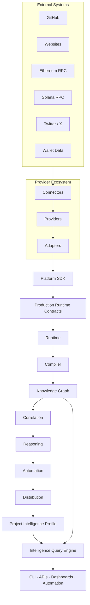

# CryptoIntel OS

### An intelligence operating system for Web3 research, analysis, and automation.

[](LICENSE)
[](https://www.python.org/)
[](VERSION)
[](.github/workflows/python-tests.yml)
[](tests)
[](#testing)
[](#roadmap)

CryptoIntel OS turns fragmented source data into canonical, explainable intelligence. It collects through isolated providers, preserves provenance, executes a deterministic intelligence pipeline, builds graph-ready projections, and produces unified project profiles that can be queried by users, applications, automation, and future AI systems.

> [!IMPORTANT]
> CryptoIntel OS is an active engineering project. Its architecture, contracts, deterministic integrations, CLI, and test fixtures are implemented. Live network transports, durable production stores, and a framework-backed REST service remain deployment work.

---

## Mission

Crypto research is distributed across repositories, websites, social channels, wallets, protocols, and rapidly changing infrastructure. Most tools expose one source at a time, return raw activity, or present conclusions without a reproducible chain of evidence.

CryptoIntel OS exists to make intelligence composable.

It establishes a stable path from source records to decisions:

- normalize heterogeneous data without losing provenance;
- distinguish observations from evidence and interpretation;
- correlate intelligence across technical, social, and on-chain identities;
- produce explainable assessments and signals;
- expose the result through profiles, graph projections, queries, CLI workflows, and integration contracts.

The goal is not to predict markets. The goal is to build dependable infrastructure for understanding projects, organizations, repositories, wallets, and their relationships.

## What is CryptoIntel OS?

CryptoIntel OS is an **Intelligence Operating System for Web3**: a modular Python platform for collecting, normalizing, processing, correlating, querying, and distributing crypto intelligence.

It is not a dashboard, a token scanner, or another analytics website. Those can be built on top of it.

The platform defines the operating layer beneath those products:

1. Providers isolate external systems.
2. Adapters create canonical Kernel objects.
3. The Platform SDK enforces the Runtime boundary.
4. Runtime compiles and projects canonical intelligence.
5. Unified Intelligence links sources into a `ProjectIntelligenceProfile`.
6. The Query Engine executes deterministic questions over profiles and canonical models.

### Why CryptoIntel OS?

| Common limitation | CryptoIntel OS approach |
|---|---|
| Data is organized by API rather than by real-world entity. | Identity linking and unified project profiles connect source records around canonical projects. |
| Raw events are presented as intelligence. | A typed pipeline separates observations, evidence, findings, assessments, and signals. |
| Conclusions cannot be audited. | Identifiers, provenance, supporting evidence, confidence, and traceability remain explicit. |
| Integrations leak provider-specific behavior into applications. | Connector → Provider → Adapter separation isolates transport, normalization, and canonical mapping. |
| New sources require changes throughout the system. | Stable provider, SDK, Kernel, and Runtime contracts constrain extension points. |
| Search is tied to presentation or storage technology. | The Query Engine provides framework-neutral filtering, aggregation, ranking, traversal, and projection. |

### Why another crypto intelligence platform?

CryptoIntel OS focuses on the problem between collection and presentation: how to turn heterogeneous source records into intelligence that is typed, attributable, deterministic, and reusable.

It does not require every source to share a schema. It requires every source to cross the same canonical boundary.

## Key Features

- **Unified Intelligence** — links identities and fuses evidence, findings, and assessments across sources.
- **Project Intelligence Profiles** — immutable, explainable views of a project and its supporting intelligence.
- **Knowledge Graph projection** — compiles canonical objects into graph nodes with provenance and timestamps.
- **Multi-source intelligence** — established domains for GitHub, Twitter/X, websites, wallets, blockchain data, and unified profiles.
- **Intelligence Query Engine** — deterministic filters, projections, aggregations, sorting, ranking, pagination, caching, time ranges, and relationship traversal.
- **Production Runtime contracts** — durable job, checkpoint, replay, recovery, lifecycle, event, persistence, observability, and provider infrastructure abstractions.
- **Provider Ecosystem** — protocol-first connectors, providers, adapters, registries, health, capability negotiation, failover, retry, and rate-limit contracts.
- **Explainable intelligence** — findings and signals retain supporting evidence, confidence, explanation, and source references.
- **Deterministic reasoning** — current Runtime strategies are reproducible and do not depend on an external model provider.
- **CLI** — project execution plus query, search, and query-plan explanation commands.
- **REST API contracts** — framework-neutral request, response, and route contracts for future API delivery.
- **Repository governance** — automated compilation, import, canonical ownership, dependency-direction, Runtime-boundary, and whitespace checks.

## Architecture Overview



The Production Runtime wraps the existing processing pipeline with lifecycle, replay, event, persistence, observability, and provider contracts. It does not replace the canonical Runtime or change intelligence behavior.

## Intelligence Pipeline


| Stage | Responsibility |
|---|---|
| `Observation` | Immutable record of source data, collection time, source version, checksum, and raw payload. |
| `Evidence` | Normalized fact linked to its originating observation and entity. |
| `Finding` | Reproducible interpretation supported by one or more evidence records. |
| `Assessment` | Versioned, policy-driven score or evaluation with explicit evidence references. |
| `Signal` | Explainable, actionable intelligence with severity, confidence, and recommendation. |
| `ProjectIntelligenceProfile` | Unified identity, evidence, findings, assessments, signals, relationships, provenance, and execution metadata. |

## Supported Intelligence Sources

| Source | Current role |
|---|---|
| GitHub | Repository discovery, engineering activity, contributors, releases, organizations, dependencies, scoring, and signals. Provider contracts cover REST repository, user, issue, pull request, commit, workflow, security, branch, topic, language, and statistics roles. |
| Twitter / X | Deterministic discovery, analysis, assessment, and signal generation from profile and post models. |
| Website | Website, page, document, and link discovery; deterministic metadata analysis and signals. HTTP provider contracts use injectable transports. |
| Wallet | Blockchain-adapted wallet discovery, classification, and deterministic whale intelligence. |
| Ethereum | JSON-RPC connector/provider/adapter contracts for blocks, transactions, wallets, balances, tokens, contracts, NFTs, logs, and receipts. |
| Solana | RPC connector/provider/adapter contracts for accounts, programs, tokens, NFTs, transactions, blocks, slots, and metadata. |
| Unified Intelligence | Cross-source identity linking, evidence fusion, finding fusion, assessment fusion, and project profile construction. |

## Core Components

| Component | Purpose |
|---|---|
| Core Intelligence Kernel | Owns canonical identity, observation, evidence, finding, assessment, signal, relationship, policy, memory, and on-chain contracts. |
| Runtime | Executes the canonical compiler → graph → correlation → reasoning → automation → distribution pipeline. |
| Production Runtime | Defines durable execution, lifecycle, event, persistence, observability, and provider contracts around Runtime. |
| Platform SDK | Enforces canonical projections and provides the supported application boundary into Runtime. |
| Provider Ecosystem | Separates external communication, source normalization, canonical adaptation, and provider management. |
| Blockchain Platform | Defines chain metadata, endpoint, capability, provider, adapter, validation, and transport contracts. |
| Unified Intelligence | Links identities and combines source intelligence into a `ProjectIntelligenceProfile`. |
| Query Engine | Executes deterministic structured queries over profiles, canonical models, and relationship graphs. |
| Intelligence Applications | Source-focused GitHub, Twitter/X, website, wallet, and related deterministic processing modules. |

## Use Cases

- Compare engineering maturity across monitored projects.
- Find projects with recent releases and high-confidence development signals.
- Trace a signal back to its originating observation and evidence.
- Link websites, repositories, social identities, and wallets to one project identity.
- Inspect wallet relationships across projects and tokens.
- Produce deterministic project profiles for research or due diligence.
- Build internal analyst tools, API services, dashboards, and automation on stable contracts.
- Validate provider integrations without coupling applications to transport SDKs.

## Who is this for?

- **Analysts and researchers** who need evidence-backed project intelligence.
- **Engineering teams** building crypto research, monitoring, or due-diligence products.
- **Security teams** investigating project, repository, contract, and wallet relationships.
- **Investors** who require reproducible technical and ecosystem signals rather than opaque scores.
- **Protocol and ecosystem teams** monitoring engineering activity, integrations, and project health.
- **Platform architects** implementing controlled provider, Runtime, graph, and query infrastructure.

## Query Examples

The Query Engine accepts immutable Python models or JSON query definitions.

```python
from src.query_engine import PredicateOperator, QueryBuilder, QueryContext, QueryEngine

query = (
    QueryBuilder("active-projects", "project")
    .where("confidence", PredicateOperator.GTE, 0.8)
    .where("source", PredicateOperator.EQ, "github")
    .select("project", "confidence", "score")
    .build()
)

execution = QueryEngine().execute(query, project_records, QueryContext("research-001"))
```

```bash
# Find high-confidence projects in supplied JSON data
python cryptointel.py query \
  '{"query_id":"active","domain":"project","filters":[{"field":"confidence","operator":"gte","value":0.8}]}' \
  --data '[{"project":"alpha","confidence":0.92}]' \
  --json --pretty --statistics

# Search wallets or projects in a deterministic dataset
python cryptointel.py search "wallet:0xabc" --data records.json --json

# Inspect the optimized query plan
python cryptointel.py explain-query \
  '{"query_id":"signals","domain":"signal","filters":[{"field":"severity","operator":"eq","value":"high"}]}' \
  --pretty
```

Relationship traversal is explicit and bounded:

```python
from src.query_engine import RelationshipGraph, RelationshipTraversal

graph = RelationshipGraph((
    ("project:alpha", "wallet", "wallet:0xabc"),
    ("wallet:0xabc", "token", "token:ETH"),
))

wallets = graph.traverse(RelationshipTraversal("project:alpha", "wallet"))
```

## CLI

```bash
python cryptointel.py github acme/repository --json
python cryptointel.py website https://example.org --pretty
python cryptointel.py wallet 0x0000000000000000000000000000000000000000 --trace
python cryptointel.py project example --json --pretty
python cryptointel.py query '<query-json>' --data '<records-json>' --statistics
python cryptointel.py search '<text>' --data '<records-json>' --json
python cryptointel.py explain-query '<query-json>' --pretty
```

The CLI currently provides deterministic local execution and fixture-backed integration validation. Network-backed transports can be injected through provider implementations without changing CLI consumers.

## Project Structure

```text
CryptoIntelOS/
├── src/
│   ├── core_intelligence/       # Canonical Kernel contracts
│   ├── runtime/                 # Runtime pipeline and production contracts
│   ├── platform_sdk/            # Canonical Runtime boundary
│   ├── providers/               # Connectors, providers, adapters, management
│   ├── blockchain_platform/     # Chain/provider foundation
│   ├── unified_intelligence/    # Cross-source fusion and profiles
│   ├── query_engine/            # Deterministic intelligence queries
│   ├── github_intelligence/     # GitHub intelligence application
│   ├── twitter_intelligence/    # Twitter/X intelligence application
│   ├── website_intelligence/    # Website intelligence application
│   └── wallet_intelligence/     # Wallet and whale intelligence
├── tests/                       # Unit, integration, architecture, Runtime tests
├── tools/                       # Repository validation
├── docs/                        # Architecture, providers, CLI, query, operations
├── catalog/                     # Source and knowledge catalogs
├── config/                      # Configuration assets
├── Dockerfile
├── docker-compose.yml
└── cryptointel.py               # CLI entry point
```

<details>
<summary>Canonical execution boundary</summary>

Applications do not pass source-specific DTOs into Runtime. Adapters produce canonical Kernel objects, Platform SDK validates the five-part canonical projection, and Runtime defensively rejects unsupported types. Compatibility paths are explicitly deprecated and routed through SDK adapters.

</details>

## Installation

### Requirements

- Python 3.13
- Git
- Platform dependencies required by Playwright when website rendering is used

### Local environment

```bash
git clone https://github.com/<organization>/CryptoIntelOS.git
cd CryptoIntelOS

python -m venv .venv
```

Activate the environment:

```bash
# Linux / macOS
source .venv/bin/activate

# Windows PowerShell
.\.venv\Scripts\Activate.ps1
```

Install dependencies:

```bash
python -m pip install --upgrade pip
python -m pip install -r requirements.txt
playwright install chromium
```

Create local configuration:

```bash
cp .env.example .env
```

Never commit `.env`, provider tokens, wallet secrets, RPC credentials, or recorded sensitive payloads.

## Quick Start

```bash
# Validate the repository
python tools/validate_repository.py

# Run a deterministic project profile
python cryptointel.py project example --json --pretty

# Run a query over supplied records
python cryptointel.py query \
  '{"query_id":"mature","domain":"project","filters":[{"field":"score","operator":"gte","value":80}]}' \
  --data '[{"project":"alpha","score":91},{"project":"beta","score":72}]' \
  --json --pretty --statistics

# Run the application entry point
python -m src
```

### Docker

```bash
docker build -t cryptointel-os .
docker run --env-file .env cryptointel-os
```

Or use Compose:

```bash
docker compose up --build
```

## Enterprise Readiness

| Capability | Status |
|---|---|
| Canonical domain ownership | Enforced by tests and repository validation |
| Runtime type boundary | Enforced by Platform SDK and defensive Runtime checks |
| Deterministic end-to-end execution | Implemented for local and fixture-backed paths |
| Provider isolation | Connector → Provider → Adapter contracts implemented |
| Durable execution contracts | Implemented; production stores are not bundled |
| Observability contracts | Trace, span, metrics, logs, health, and timeline abstractions implemented |
| CI | Compile, import, repository validation, pytest, and CodeQL workflows configured |
| Docker startup | Canonical module entry implemented |
| REST delivery | Framework-neutral contracts implemented; server not bundled |
| Distributed execution | Designed through contracts; queue/store implementations remain future work |

CryptoIntel OS is suitable for architecture evaluation, deterministic research workflows, provider implementation, and controlled integration pilots. Unattended production deployments require durable store implementations, operational transports, secret management, monitoring backends, and deployment-specific hardening.

## Performance

The platform favors deterministic execution and traceability over hidden optimization.

- Runtime stages operate synchronously and in memory in the current reference implementation.
- Graph projection is linear in the number of canonical Runtime objects for the deterministic compiler path.
- Query filtering, sorting, aggregation, and traversal are explicit and locally measurable.
- The v1.2 query benchmark scanned 10,000 fixture records, matched 5,000, and returned 100 in approximately **38.6 ms** on the development environment used for release validation. This is a fixture benchmark, not a production SLO.

See [Benchmarking](docs/benchmarking.md) for measurement guidance.

## Development

### Architecture principles

- Keep canonical ownership in `src/core_intelligence`.
- Create canonical business objects only in adapters.
- Enter Runtime through Platform SDK.
- Preserve identifiers, provenance, traceability, confidence, and execution metadata.
- Extend stable protocols rather than importing provider implementations into domain logic.
- Do not add a second orchestration path.

### Quality gates

Before every commit:

```bash
python tools/validate_repository.py
python -m compileall -q src tests
python -m pytest
git diff --check
```

The repository validator checks compilation, supported imports, canonical model ownership, forbidden Runtime orchestration imports, dependency direction, and whitespace errors.

## Testing

The test suite includes:

- Kernel contract and canonical ownership tests;
- Runtime compiler, graph, correlation, reasoning, automation, and distribution tests;
- durable lifecycle, replay, checkpoint, event, observability, and provider contract tests;
- GitHub, Twitter/X, website, wallet, blockchain, and Unified Intelligence tests;
- provider ecosystem and mock-transport integration tests;
- CLI, system integration, query, cache, traversal, and performance tests;
- repository health and startup checks.

```bash
python -m pytest
python -m pytest tests/test_query_engine.py
python -m pytest tests/test_system_integration.py
```

Live provider tests must remain optional. CI must not require external connectivity or real credentials.

## Design Principles

### Guiding Principles

1. **Canonical ownership** — one authoritative owner for each core business contract.
2. **Immutability** — historical intelligence should not change after creation.
3. **Determinism** — the same canonical input and policy should produce reproducible output.
4. **Explainability** — conclusions must retain supporting evidence and explanation.
5. **Traceability** — every stage preserves identifiers and execution context.
6. **Provider isolation** — transport and vendor behavior stay outside domain logic.
7. **Separation of concerns** — collection, normalization, mapping, execution, querying, and presentation remain distinct.
8. **Backward compatibility** — public legacy interfaces are deprecated explicitly, not silently removed.
9. **Architecture freeze** — new product work should use established boundaries unless a proven production blocker requires change.
10. **User value** — infrastructure work must improve reliability, clarity, performance, or usability for real users.

## Roadmap

### Completed foundations

- [x] Core Intelligence Kernel
- [x] Canonical observations, evidence, findings, assessments, and signals
- [x] Runtime compiler, graph, correlation, reasoning, automation, and distribution pipeline
- [x] Platform SDK canonical boundary
- [x] Blockchain Platform and canonical on-chain contracts
- [x] GitHub, Twitter/X, website, and wallet intelligence applications
- [x] Unified identity, evidence, finding, and assessment fusion
- [x] Project Intelligence Profiles
- [x] Production Runtime contracts
- [x] Provider Ecosystem contracts
- [x] Deterministic provider transport fixtures
- [x] System integration CLI
- [x] Intelligence Query Engine
- [x] Repository validation and CI workflows

### Productization priorities

- [ ] Harden real HTTP and JSON-RPC transports with production authentication, pooling, rate limits, retries, metrics, and tracing
- [ ] Implement durable execution, event, checkpoint, graph, and profile stores
- [ ] Deliver a framework-backed authenticated REST API
- [ ] Add operational health, metrics, tracing, and alerting backends
- [ ] Build project, wallet, signal, graph, provider, and Runtime dashboards
- [ ] Add structured report generation and export
- [ ] Establish deployment SLOs, load tests, recovery tests, and production security review

## Documentation

| Area | Documentation |
|---|---|
| Architecture | [Architecture documentation](docs/architecture/) |
| Production Runtime | [Production Runtime](docs/architecture/production-runtime.md) |
| Runtime canonical boundary | [Canonical projection](docs/architecture/runtime-canonical-projection.md) |
| Runtime path consolidation | [Path consolidation](docs/architecture/runtime-path-consolidation.md) |
| Provider Ecosystem | [Provider architecture](docs/architecture/provider-ecosystem.md) |
| Provider development | [Provider development guide](docs/providers/provider-development-guide.md) |
| GitHub provider | [GitHub](docs/providers/github.md) |
| Website provider | [Website](docs/providers/website.md) |
| Ethereum provider | [Ethereum](docs/providers/ethereum.md) |
| Solana provider | [Solana](docs/providers/solana.md) |
| Query Engine | [Query Engine](docs/query-engine.md) · [Query language](docs/query-language.md) · [API contracts](docs/query-api.md) |
| CLI | [CLI guide](docs/cli.md) |
| System integration | [System integration](docs/system-integration.md) |
| Benchmarking | [Benchmarking](docs/benchmarking.md) |
| Repository health | [Repository health](docs/architecture/repository-health.md) |

## Contributing

Contributions are welcome when they preserve the platform boundaries and improve a real user or operator outcome.

1. Read [AGENTS.md](AGENTS.md) and the relevant architecture documents.
2. Open an issue describing the user problem, affected boundary, and validation plan.
3. Keep changes focused; do not mix architecture refactors with feature work.
4. Add unit, integration, contract, failure, or regression tests proportional to risk.
5. Run all repository quality gates.
6. Document configuration, operations, security implications, and known limitations.

Pull requests that bypass adapters, construct canonical objects in providers, invoke Runtime outside Platform SDK, or introduce duplicate canonical models should not be merged.

## Security

- Never hardcode provider credentials, API keys, RPC secrets, or wallet material.
- Inject authentication through configuration and transport boundaries.
- Do not log authorization headers, secrets, private source payloads, or sensitive wallet metadata.
- Validate provider configuration and external payloads before canonical mapping.
- Use TLS for production HTTP and RPC transports.
- Keep live integration tests opt-in and isolated from CI secrets.
- Review dependency advisories and CodeQL findings before release.

For responsible disclosure, contact **security@your-domain.example** or use the repository's private security advisory process. Replace this placeholder before public launch.

## Frequently Asked Questions

<details>
<summary><strong>Is CryptoIntel OS a trading bot?</strong></summary>

No. It is infrastructure for collecting, processing, correlating, and querying explainable intelligence. Automation contracts exist, but no trading behavior is implemented.

</details>

<details>
<summary><strong>Does it use AI models?</strong></summary>

The current Runtime reasoning path is deterministic and does not require an external AI provider. The architecture can support future AI systems without making them the owner of canonical facts or provenance.

</details>

<details>
<summary><strong>Are the GitHub, Website, Ethereum, and Solana integrations live?</strong></summary>

The provider roles, configuration, adapters, and mockable transport paths are implemented. Network transports remain injectable and deterministic fixtures are used for mandatory tests. Production networking and live tests require deployment-specific implementations and credentials.

</details>

<details>
<summary><strong>Can I build an API or dashboard on top of it?</strong></summary>

Yes. Project profiles, graph projections, query results, Runtime results, provider health contracts, CLI workflows, and framework-neutral API contracts are designed for those product layers. A bundled web server and dashboard are roadmap items.

</details>

<details>
<summary><strong>Why is the architecture strict about adapters?</strong></summary>

Adapters are the single canonical conversion boundary. Keeping transport and provider representations outside the Kernel prevents vendor-specific schemas from becoming platform-wide dependencies.

</details>

<details>
<summary><strong>Is CryptoIntel OS production-ready?</strong></summary>

The repository has mature architectural contracts, deterministic integration paths, validation tooling, and broad tests. A production deployment still requires durable store implementations, hardened live transports, secrets management, monitoring backends, resource controls, and deployment-specific security review.

</details>

## License

CryptoIntel OS is available under the [MIT License](LICENSE).

## Acknowledgements

CryptoIntel OS builds on established ideas from event-driven systems, compiler pipelines, knowledge graphs, distributed tracing, protocol-oriented design, and evidence-based intelligence analysis. It also relies on the broader Python and open-source ecosystem.

The project is developed with respect for the maintainers, researchers, infrastructure teams, and protocol communities whose work makes reproducible crypto intelligence possible.

---

<p align="center">
  <strong>CryptoIntel OS</strong><br/>
  Canonical data. Explainable intelligence. Deterministic execution.
</p>
