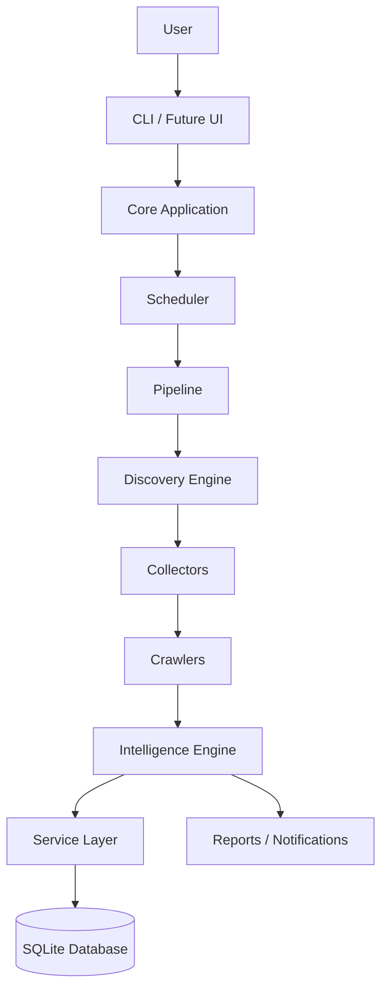
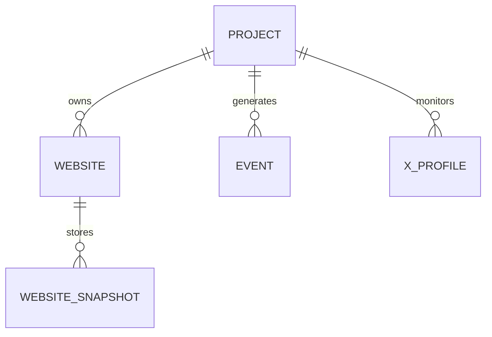
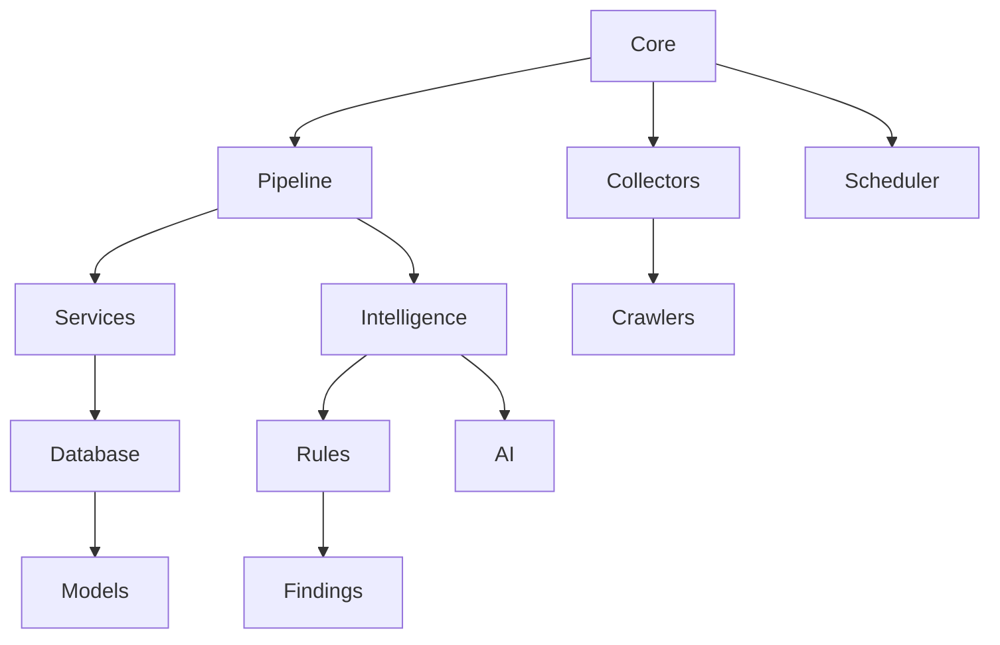

# Architecture Diagrams

This document provides visual representations of the CryptoIntel OS architecture using Mermaid diagrams.

---

# High-Level System Architecture



---

# Collector Pipeline

```mermaid
flowchart LR

Project

↓

Discovery

↓

Collector Registry

↓

Website Collector

↓

X Collector

↓

Future Collectors

↓

Collector Result

↓

Pipeline
```

---

# Website Crawling Flow

```mermaid
flowchart TD

Start

↓

Queue

↓

Page Fetcher

↓

HTML Parser

↓

Content Extractor

↓

Link Extractor

↓

Quality Analyzer

↓

Next Pages

↓

Website Snapshot

↓

Database
```

---

# Intelligence Pipeline

```mermaid
flowchart LR

Raw Data

↓

Normalization

↓

Feature Extraction

↓

Rule Engine

↓

AI Analysis

↓

Signal Generation

↓

Confidence Score

↓

Finding

↓

Report
```

---

# Service Layer

```mermaid
flowchart TD

Application

↓

Services

↓

Repositories

↓

Database
```

---

# Repository Pattern

```mermaid
flowchart LR

Service

↓

Repository

↓

SQLite
```

---

# Scheduler

```mermaid
flowchart TD

Scheduler

↓

Discovery

↓

Collectors

↓

Pipeline

↓

Analysis

↓

Storage

↓

Notifications
```

---

# Database Architecture



---

# Package Dependencies



---

# Future Architecture

```mermaid
flowchart TD

Collectors

↓

Message Queue

↓

Workers

↓

Distributed Intelligence

↓

Central Database

↓

Dashboard

↓

API

↓

Users
```

---

# Long-Term Vision

```mermaid
flowchart LR

Discovery

-->

Collection

-->

Analysis

-->

Knowledge Graph

-->

Risk Scoring

-->

Alerts

-->

Dashboard

-->

API

-->

External Systems
```

---

# Deployment Architecture

```mermaid
flowchart TD

GitHub

↓

Clone Repository

↓

Setup.ps1

↓

Virtual Environment

↓

Install Dependencies

↓

Configuration

↓

Run Application
```

---

# AI Migration Flow

```mermaid
flowchart LR

README

-->

AI Context

-->

Architecture Docs

-->

Migration Guide

-->

Project State

-->

Development

-->

Continue Coding
```

---

# Summary

These diagrams provide a high-level understanding of CryptoIntel OS without requiring a deep dive into the implementation.

They are intended to assist:

- Developers
- Contributors
- AI coding agents
- Project maintainers

As the project evolves, these diagrams should be updated to reflect major architectural changes.